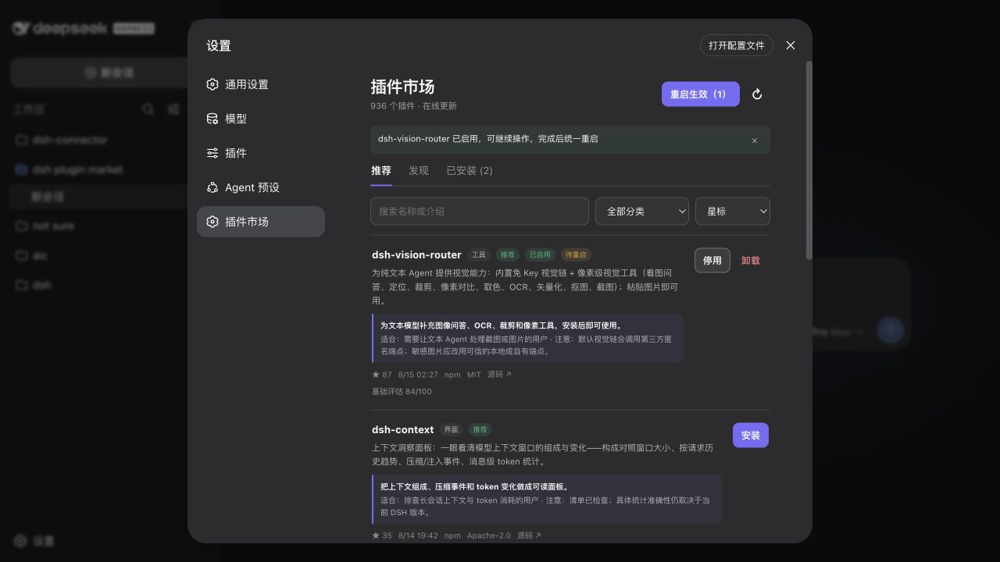

<div align="center">

# DSH Plugin Market

### 900+ DSH 插件，一个搜索框，一个安装按钮。

在 DeepSeek Harness 里发现、安装和管理插件。极简、轻量、开箱即用。

[](https://github.com/Strangelight-Merser/dsh-plugin-market/releases/latest)
[](https://github.com/Strangelight-Merser/dsh-plugin-market/actions/workflows/ci.yml)
[](LICENSE)

</div>



## 30 秒上手

安装：

```bash
dsh plugin --profile web add --ignore-scripts https://github.com/Strangelight-Merser/dsh-plugin-market/releases/download/v0.5.0/dsh-plugin-market-0.5.0.tgz
```

启动：

```bash
dsh web
```

打开 **设置 → 插件市场**。当前版本适配 `@deepseek-ai/dsh@0.1.0-rc.6` 的 Web profile。

## 能做什么

- 按界面、主题、会话、记忆、工具等功能分类，支持星标与更新时间排序。
- 展示完整介绍、源码、许可证和基础评估，人工推荐值得先看的项目。
- 一键安装并默认启用，也可停用、启用或卸载。
- 连续完成多项操作后，一键重启统一生效。
- 启动时、每六小时或手动刷新在线目录。

## 安全边界

入库项目必须具有合法包名、`dsh.bundle.patch` 和宿主入口；这不是安全审计或兼容性承诺。依赖安装脚本始终禁用，第三方插件仍会以你的用户权限运行，请只安装你信任的来源。

[评估与推荐](EVALUATION.md) · [数据来源](DATA_SOURCES.md) · [安全策略](SECURITY.md) · [路线图](ROADMAP.md) · [参与贡献](CONTRIBUTING.md)

## English

A minimal plugin market built into DeepSeek Harness. Discover 900+ plugins by function, inspect their source and assessment, manage them in one click, then apply every pending change with a single restart.
